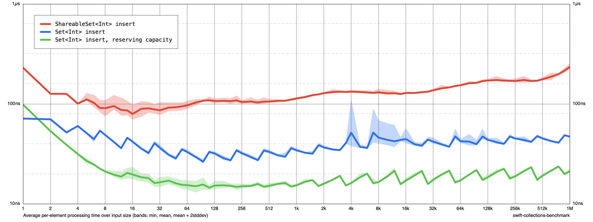

# Shareable Hashed Collections Module

- Authors: [Michael Steindorfer](https://github.com/msteindorfer), [Karoy Lorentey](https://forums.swift.org/u/lorentey)
- Implementation: https://github.com/apple/swift-collections/tree/release/1.1/Sources/ShareableHashedCollections

## Table of contents

* [Introduction](#introduction)
* [Motivation](#motivation)
* [Proposed solution](#proposed-solution)
    - [`ShareableSet`](#shareableset)
    - [`ShareableDictionary`](#shareabledictionary)
* [Detailed design](#detailed-design)

## Introduction

`ShareableHashedCollections` is a new module in Swift Collections, containing new hashed collection types that store their elements in a prefix tree structure, based on their hash values. The new types are tree-based equivalents to the standard `Set` and `Dictionary`; they're called `ShareableSet` and `ShareableDictionary`.

Like the standard hashed collections, `ShareableSet` and `ShareableDictionary` are unordered collections of unique items. However, the new collections are optimizing for making mutations of shared copies as efficient as practical, both by making such changes faster, but, just as importantly, by letting mutated copies of the same collection value share as much of their structure as possible, saving a considerable amount of memory.

## Motivation

Well-behaved Swift collection types are typically expected to implement the copy-on-write optimization: in this scheme, making copies of collection values is an O(1) operation, but the first time one of the copies gets mutated, its storage needs to be made unique.

In the case of the standard collection types, the only way to make a collection value's storage unique is to copy the entire collection into newly allocated storage. This maintains the illusion of value semantics, but such all-or-nothing copying can lead to undesirable spikes in complexity. Inserting an item will usually take constant time, but if we aren't careful about making copies, it _sometimes_ jumps to linear complexity, which can easily render the code unusably slow, especially when the operation is called inside a loop.

As a toy example, consider a case of a system where we want to allow the user to arbitrarily mutate a set of integers, then periodically (say, every time we want to refresh the screen) we compare the current set to the one we previously saw, and do something based on the differences. To keep things simple, let's say we are just inserting a sequence of integers one by one, and we want to update the display state after every insertion:

```swift
typealias Model = Set<Int>

var _state: Model // Private
func updateState(
  with model: Model
) -> (insertions: Set<Int>, removals: Set<Int>) {
  let insertions = model.subtracting(_state)
  let removals = _state.subtracting(model)
  _state = model
  return (insertions, removals)
}

let c = 1_000_000
var model: Model = []
for i in 0 ..< c {
  model.insert(i)
  let r = updateState(with: model)
  precondition(r.insertions.count == 1 && r.removals.count = 0)
}
```

(Of course, ideally the set would remember precisely what items got inserted/removed in it since the last time a snapshot was made, so calculating the difference would be a trivial operation. But if we aren't able to maintain such a change log, this might be a reasonably pragmatic fallback approach.)

With the standard `Set` type, having to keep a copy of the model around is inconvenient: it not only makes the first mutation after the `updateState` call slow, but it also roughly doubles the memory that we need to use, as the new version of the model will need to have its own, completely independent storage. Even worse, calculating the differences between the current model and its previous snapshot is quite expensive: we don't have any information about what changed, so the `subtracting` operations need to carefully compare each item one by one -- there aren't any useful shortcuts.

Overall, the model update and the diffing operations all take time that's proportional to the number of items in the set, making it difficult to update the display state with high enough frequency once the set grows above a certain size.

This all-or-nothing copy-on-write behavior can be eliminated by organizing the contents of hashed collections into a prefix tree of hash values rather than a single flat hash table. `ShareableSet` and `ShareableDictionary` use tree nodes that contain at most 32 items -- each of which can either be a direct key-value pair, or a reference to a child node containing more items. The nodes themselves work like tiny hash tables themselves: each node along the path from the root to any given item handles 5 bits (2^5 == 32) worth of data from the item's hash value. New nodes get created whenever a new item's hash value matches another's up to the depth currently covered by its path; such collisions are resolved by allocating a new node that looks at 5 more bits' worth of information until the items can be distinguished or we exhaust all available bits in the hash value. (Special collision nodes handle items that fall in the latter case.)

A key aspect of this structure is that individual nodes can be reference counted, so they can be easily shared across different instances of the same collection type. Copies of collection values can be made just as easily as with the flat hash table -- we just need to make a copy of the reference to the root node, incrementing its reference count. Furthermore, when we need to insert a new item (or remove an existing one) from such a copy, we only need to make copies of the nodes along its path: all other nodes can continue to be linked into both trees.

This boosts the performance of shared mutations from linear to logarithmic time, bringing along a corresponding improvement to memory use -- two set values that only diverged slightly are still expected to share most of their storage.

Better, the trees are able to organically grow or shrink their storage to fit their contents: we don't need to think about reserving capacity, and we don't need to worry about temporary spikes in a collection's size inducing a corresponding increase in its size that lingers long after the collection is restored to a more typical size.

Sharing storage nodes between collection instances also brings about additional benefits: when comparing or combining two sets (or dictionaries), we can easily detect shared nodes and we can typically handle their entire subtree as a single unit, instead of having to individually compare/combine their items. For example, when subtracting one set from another, nodes that are shared between them can simply be skipped when building the result, without even looking at any of their contained items.

For example, simply changing the model type from `Set<Int>` to `ShareableSet<Int>` leads to an algorithmic improvement to running time:

```swift
typealias Model = ShareableSet<Int>

... // Same code as before
```

For a million items, the code that uses `Set` would have taken roughly five hours to run; the variant that uses `ShareableCode` runs in about two seconds!

Plotting the average time spent over one iteration of the loop on a log-log chart, we get the following result:


Over the entire spread of item counts from 1 to a million, `Set` goes from 100ns to >10ms spent in each iteration -- an increase of five orders of magnitude, corresponding to a linear growth rate. Meanwhile `PeristentSet`'s growth is kept nicely logarithmic: its 8-10x growth factor is far removed from the growth rate of its input data.

For this particular use case, hash-array mapped prefix trees proved to be a far better data structure than a flat hash table. Of course, this does not mean that `ShareableSet` is going to always be a better choice than `Set` -- as always, it depends on the use case.

Maintaining the prefix tree involves a lot more bookkeeping than a flat hash table, including having to descend through multiple nodes when looking up items or iterating through the collection:


Not having to think about reserving capacity also means that the tree cannot preallocate nodes in advance, even if we know exactly how many items we will need to insert -- it needs to organically allocate/deallocate nodes as needed. The more complicated structure therefore leads to worse expected behavior (by a constant factor) when the use case cannot exercise the benefits of node sharing, such as when we only mutate a single dictionary in place, without ever making a copy of it.



(Still, certain use cases might still accept the constant-factor slowdown in exchange for the freedom of not having to worry about memory management.)

## Proposed solution

We propose to introduce a new Swift Collections module, called `ShareableHashedCollections`, with two top-level public types, `ShareableSet` and `ShareableDictionary`.

### `ShareableSet`

`ShareableSet` is a type with one generic argument, `Element`, required to be `Hashable`. Like the standard `Set`, `ShareableSet` is a `SetAlgebra` that is a forward-only, unordered `Collection` with an opaque index type. It is `Hashable` and conditionally `Sendable` and `Codable`, depending on its `Element`:

```swift
struct ShareableSet<Element: Hashable>
 : Sequence, Collection, 
   SetAlgebra, 
   Equatable, Hashable, 
   CustomStringConvertible, CustomDebugStringConvertible, CustomReflectable, 
   ExpressibleByArrayLiteral
{}

extension ShareableSet: Sendable where Element: Sendable {}
extension ShareableSet: Decodable where Element: Decodable {}
extension ShareableSet: Encodable where Element: Encodable {}
```

Internally, `ShareableSet` organizes its elements into a hash-array mapped prefix tree. To speed up indexing operations in such a structure, each index in a `ShareableSet` value contains a direct storage reference to the node within the tree that contains the element addressed. This means that unlike with `Set`, `ShareableSet` indices need to get invalidated on every mutation.

#### Creating a Set

```swift
init()
init<S: Sequence>(S)
init(`Self`)
init<Value>(ShareableDictionary<Element, Value>.Keys)
```

#### Finding Elements

```swift
func contains(Element) -> Bool
func firstIndex(of: Element) -> Index?
func lastIndex(of: Element) -> Index?
```

#### Adding and Updating Elements

```swift
mutating func insert(Element) -> (inserted: Bool, memberAfterInsert: Element)
mutating func update(with: Element) -> Element?
mutating func update(Element, at: Index) -> Element
```

#### Removing Elements

```swift
mutating func remove(Element) -> Element?
mutating func remove(at: Index) -> Element
func filter((Element) throws -> Bool) rethrows -> ShareableSet<Element>
mutating func removeAll(where shouldBeRemoved: (Element) throws -> Bool) rethrows
```

#### Combining Sets

All the standard combining operations (intersection, union, subtraction and symmetric difference) are supported, in both non-mutating and mutating forms. `SetAlgebra` only requires the ability to combine one set instance with another, but `ShareableSet` follows the tradition established by `Set` in providing additional overloads to each operation that allow combining a set with additional types, including arbitrary sequences.

```swift
func intersection(`Self`) -> ShareableSet<Element>
func intersection<Value>(ShareableDictionary<Element, Value>.Keys) -> ShareableSet<Element>
func intersection<S>(S) -> ShareableSet<Element>

func union(`Self`) -> ShareableSet<Element>
func union<Value>(ShareableDictionary<Element, Value>.Keys) -> ShareableSet<Element>
func union<S>(S) -> ShareableSet<Element>

func subtracting(`Self`) -> ShareableSet<Element>
func subtracting<V>(ShareableDictionary<Element, V>.Keys) -> ShareableSet<Element>
func subtracting<S>(S) -> ShareableSet<Element>

func symmetricDifference(`Self`) -> ShareableSet<Element>
func symmetricDifference<Value>(ShareableDictionary<Element, Value>.Keys) -> ShareableSet<Element>
func symmetricDifference<S>(S) -> ShareableSet<Element>

mutating func formIntersection(`Self`)
mutating func formIntersection<Value>(ShareableDictionary<Element, Value>.Keys)
mutating func formIntersection<S>(S)

mutating func formUnion(`Self`)
mutating func formUnion<Value>(ShareableDictionary<Element, Value>.Keys)
mutating func formUnion<S>(S)

mutating func subtract(`Self`)
mutating func subtract<Value>(ShareableDictionary<Element, Value>.Keys)
mutating func subtract<S>(S)

mutating func formSymmetricDifference(`Self`)
mutating func formSymmetricDifference<Value>(ShareableDictionary<Element, Value>.Keys)
mutating func formSymmetricDifference<S>(S)
```

#### Comparing Sets

`ShareableSet` supports all standard set comparisons (subset tests, superset tests, disjunctness test), including the customary overloads established by `Set`. As an additional extension, the `isEqualSet` family of member functions generalize the standard `==` operation to support checking whether a `ShareableSet` consists of exactly the same members as an arbitrary sequence. Like `==`, the `isEqualSet` functions ignore element ordering and duplicates (if any).

```swift
static func == (`Self`, `Self`) -> Bool
func isEqualSet(to: `Self`) -> Bool
func isEqualSet<Value>(to: ShareableDictionary<Element, Value>.Keys) -> Bool
func isEqualSet<S>(to: S) -> Bool

func isSubset(of: `Self`) -> Bool
func isSubset<Value>(of: ShareableDictionary<Element, Value>.Keys) -> Bool
func isSubset<S>(of: S) -> Bool

func isSuperset(of: `Self`) -> Bool
func isSuperset<Value>(of: ShareableDictionary<Element, Value>.Keys) -> Bool
func isSuperset<S>(of: S) -> Bool

func isStrictSubset(of: `Self`) -> Bool
func isStrictSubset<Value>(of: ShareableDictionary<Element, Value>.Keys) -> Bool
func isStrictSubset<S>(of: S) -> Bool

func isStrictSuperset(of: `Self`) -> Bool
func isStrictSuperset<Value>(of: ShareableDictionary<Element, Value>.Keys) -> Bool
func isStrictSuperset<S>(of: S) -> Bool

func isDisjoint(with: `Self`) -> Bool
func isDisjoint<Value>(with: ShareableDictionary<Element, Value>.Keys) -> Bool
func isDisjoint<S>(with: S) -> Bool
```

### `ShareableDictionary`

`ShareableDictionary` is a type with two generic arguments, `Key` and `Value`, of which `Key` is required to be `Hashable`. Like the standard `Dictionary`, it implements a forward-only, unordered `Collection` of key-value pairs, with custom members providing efficient support for retrieving the value of any given key. `ShareableDictionary` is conditionally `Sendable`, `Codable`, `Equatable` and `Hashable`, depending on its `Key` and `Value` types.

```swift
struct ShareableDictionary<Key: Hashable, Value>
  : Sequence, Collection,
    CustomStringConvertible, CustomDebugStringConvertible, CustomReflectable,
    ExpressibleByDictionaryLiteral
{}

extension ShareableDictionary: Sendable where Key: Sendable, Value: Sendable {}
extension ShareableDictionary: Equatable where Value: Equatable {}
extension ShareableDictionary: Hashable where Value: Hashable {}
extension ShareableDictionary: Decodable where Key: Decodable, Value: Decodable {}
extension ShareableDictionary: Encodable where Key: Encodable, Value: Encodable {}
```

Internally, `ShareableDictionary` organizes its elements into a hash-array mapped prefix tree. To speed up indexing operations in such a structure, each index in a `ShareableDictionary` value contains a direct storage reference to the node within the tree that contains the element addressed. This means that unlike with `Dictionary`, `ShareableDictionary` indices are invalidated on every mutation, including mutations that only affect a value within the dictionary.

#### Collection Views

`ShareableDictionary` provides the customary dictionary views, `keys` and `values`. These are collection types that are projections of the dictionary itself, with elements that match only the keys or values of the dictionary, respectively. The `Keys` view is notable in that it provides operations for subtracting and intersecting the keys of two dictionaries, allowing for easy detection of inserted and removed items between two snapshots of the same dictionary. Because `ShareableDictionary` needs to invalidate indices on every mutation, its `Values` view is not a `MutableCollection`.

```swift
ShareableDictionary.Keys
ShareableDictionary.Values

var keys: Keys
var values: Values

extension ShareableDictionary.Keys {
  func contains(Element) -> Bool
  
  func intersection(ShareableSet<Key>) -> Self
  func intersection<Value2>(ShareableDictionary<Key, Value2>.Keys) -> Self

  func subtracting(ShareableSet<Key>) -> Self
  func subtracting<Value2>(ShareableDictionary<Key, Value2>.Keys) -> Self
}
```

#### Creating a Dictionary

```swift
init()
init(ShareableDictionary<Key, Value>)
init(Dictionary<Key, Value>)
init<S>(uniqueKeysWithValues: S)
init<S>(S, uniquingKeysWith: (Value, Value) throws -> Value) rethrows
init<S>(grouping: S, by: (S.Element) throws -> Key) rethrows
init(keys: ShareableSet<Key>, valueGenerator: (Key) throws -> Value) rethrows
```

#### Inspecting a Dictionary

```swift
var isEmpty: Bool
var count: Int
```

#### Accessing Keys and Values

```swift
subscript(Key) -> Value?
subscript(Key, default _: () -> Value) -> Value
func index(forKey: Key) -> Index?
```

#### Adding or Updating Keys and Values

Beyond the standard `updateValue(_:forKey:)` method, `ShareableDictionary` also provides additional `updateValue` variants that take closure arguments. These provide a more straightforward way to perform in-place mutations on dictionary values (compared to mutating values through the corresponding subscript operation.) `ShareableDictionary` also provides the standard `merge` and `merging` operations for combining dictionary values.

```swift
mutating func updateValue(Value, forKey: Key) -> Value?
mutating func updateValue<R>(forKey: Key, with: (inout Value?) throws -> R) rethrows -> R
mutating func updateValue<R>(forKey: Key, default: () -> Value, with: (inout Value) throws -> R) rethrows -> R

mutating func merge(`Self`, uniquingKeysWith: (Value, Value) throws -> Value) rethrows
mutating func merge<S>(S, uniquingKeysWith: (Value, Value) throws -> Value) rethrows

func merging(`Self`, uniquingKeysWith: (Value, Value) throws -> Value) rethrows -> ShareableDictionary<Key, Value>
func merging<S>(S, uniquingKeysWith: (Value, Value) throws -> Value) rethrows -> ShareableDictionary<Key, Value>
```

#### Removing Keys and Values

```swift
mutating func removeValue(forKey: Key) -> Value?
mutating func remove(at: Index) -> Element
func filter((Element) throws -> Bool) rethrows -> ShareableDictionary<Key, Value>
mutating func removeAll(where shouldBeRemoved: (Element) throws -> Bool) rethrows
```

#### Comparing Dictionaries

```swift
static func == (`Self`, `Self`) -> Bool
```

#### Transforming a Dictionary

```swift
func mapValues<T>((Value) throws -> T) rethrows -> ShareableDictionary<Key, T>
func compactMapValues<T>((Value) throws -> T?) rethrows -> ShareableDictionary<Key, T>
```

## Detailed design

For a precise list of all public APIs in the `ShareableHashedCollections` module, see the DocC documentation that is (temporarily) available at:

[https://lorentey.github.io/swift-collections/ShareableHashedCollections/documentation/shareablehashedcollections/](https://lorentey.github.io/swift-collections/ShareableHashedCollections/documentation/shareablehashedcollections/)

Alternatively, you can browse the proposed implementation at:

[https://github.com/apple/swift-collections/tree/release/1.1/Sources/ShareableHashedCollections](https://github.com/apple/swift-collections/tree/release/1.1/Sources/ShareableHashedCollections)

## Alternatives Considered

### Naming

The initial version of this document proposed to name the new types `PersistentSet` and `PersistentDictionary`, after the term of art "persistent data structure". Based on review feedback, we changed this to the current names. The new names eliminate confusion about the word "persistent", while also preserving the following important properties:

1. The name succinctly labels the primary feature that distinguishes them from existing collection types in this package and the Standard Library. In our case, this feature is that these types are pretty good at mutating copied values. because they can continue to share parts of their storage with their copies after such mutations.
2. The meaning is still at least _somewhat_ understandable to folks who are familiar with this feature in, say, a purely functional context. (There is a bit of handwaving here -- the precise term "shareable" have never been applied to data structures in this (or from what I can tell, any other) sense. However, pointing out the possibility of shared storage seems to be striking a chord that other options have failed to match.)

Another widespread preexisting alternative term for such data structures is "immutable"; unfortunately, it is not applicable here.

